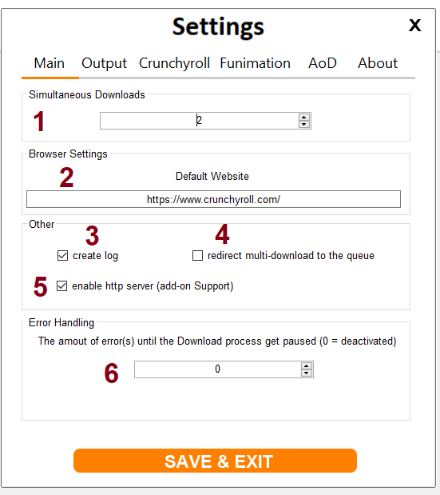
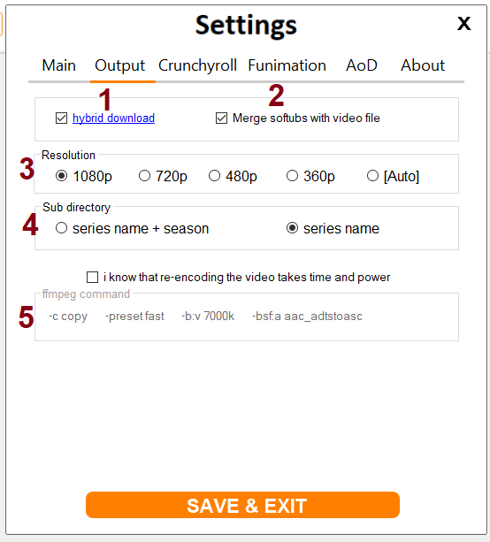
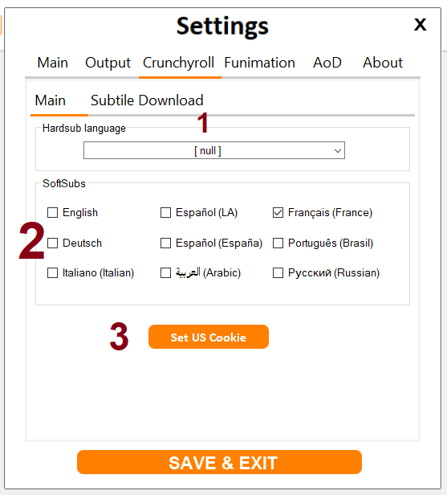

# Crunchyroll-Downloader-v3.0
A simple to use Download Client for Crunchyroll, Funimation and Anime on Demand 

## Software Requirements: 
 - Windows 10 or Windows 8.1
 - Microsoft Visual C++ 2017 Redistributable

## User Interface 
#### Main window

The main screen you after starting the application looks like this (v3.6)

1) This is the "add" button, a click on it will open the add dialog (more on that below).

2) Here we find the build in Webbrowser. This is the part wich i use to connect to the adress you put in and which gives me the data to search for the video.
   The only time you need this is to login if you want to access anything that is just for Premium members from the streaming sites 

3) You want to see a status while the downoloader is adding new video? Well, you find it here!   

4) #### Settings
    Here is a little bit more to be seen.
    
    
    
    1 . The amount of download running on the same time, other download will not be added. Sinlge episodes will moved into the queue.
    
    2 . This is just the default website, if the browser is not currently running in the background (to get the data from the website) it will open with this url.

    3 . The log file of the background process. I use to handle the media files the open source libary "ffmpeg". ffmpeg is command line tool and i just process the output in the    background and display the result, this setting saves the raw output so i can look at it and improve the interpretation of that text 
    
    4 . This will save all selected urls from the multi-download to the queue instad of directly adding them one by one.
    
    5 . For the Firefox and Chrome add-on i need to move data to and from the downloader, i make a local http server (on 127.0.0.1) which servers for that. If you want to use the add-ons you need to enable this, if you don't need it just ignore it. 
    
    6 . This is relative new, while the downloader processes the status of the download it can catch error which can result in a view second skip in the video. This is by default turned off with the value "0". From value 1 to 100 is on, the number is at the same time the tolerance of after how much it should trigger the error mode. As example the value of "1" would trigger at the first missing piece and set the download at a paused state which you need to resume/cancle/retry by hand!  

   Now page 2 
   
 
 
  1. https://www.youtube.com/watch?v=s_SY3RM1F3Y
         
  2. This option has not only a spelling mistake in it, it also allows you to move the normaly external subtitle file into the mp4 file so you just get one file but still can turn of the subtitle if you want.
  
  3. Do i have to explain here something? expet from [Auto] means the downloader does not care to even look for resolution outside of the Hybride
 mode where it needs to work itself and will work with 1080p as value because it is "Made in Germany" and that means Quality*! 
 
 4. You can create a subfolder for the download either just by the series name or even also make another subfolder for the season.
 
 5. if you don't know what re-enconding means just don't touch this and choose a lower resoltion.
  
   
 
   this already gets less... 
   
   1. "Hardsub language" means the subtitle you choose here are paintet/burned into the video image itself and can not be removed, this has the benefit everything that can playback the video can display the subtitle because it's the same thing. [null] means nothing/without or "raw".
   
   2. "SoftSubs" are small text files with all time and text from the video and needs to bet read by the playback device/software.
   
   3. Crunchyroll still belives at first what the cookies says, that you have a [insert your country] IP-Adress is irrelivent for them as long the cookie says you are from the US, so press the button and solve the captcha and follow the websites instrction. 
   
 #### to be continued 
 
